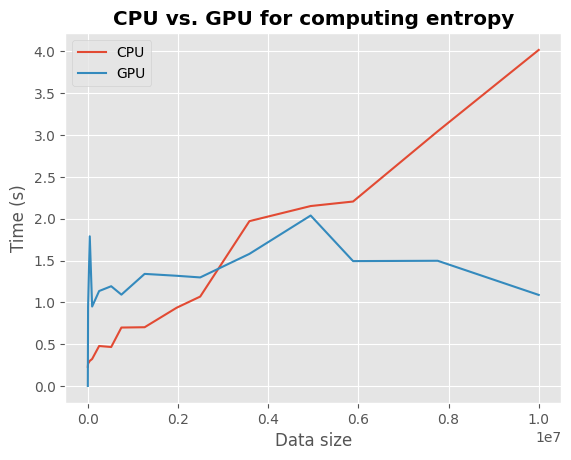
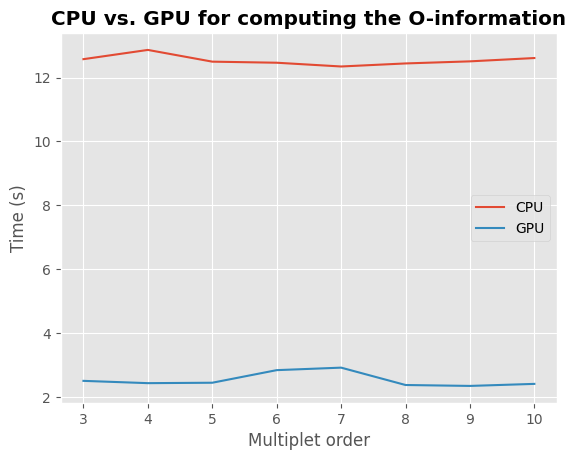

Jax: linear algebra backend
===========================

One of the main issues in the study of the higher-order structure of complex systems is the computational cost required to investigate one by one all the multiplets of any order. When using information theoretic tools, one must consider the fact that each metric relies on a complex set of operations that have to be performed for all the multiplets of variables in the data set. The number of possible multiplets of :math:`k` nodes in a data set grows as :math:`\binom{n}{k}`. This means that, in a data set of :math:`100` variables, the multiples of three nodes are :math:`\simeq 10^5`, the multiples of 4 nodes, :math:`\simeq 10^6` and 5 nodes, :math:`\simeq 10^7`, etc. This leads to huge computational costs and time that can pose real problems to the study of higher-order interactions in different research fields.

In this toolbox to deal with this problem, we used the recently developed Python library `Jax <https://github.com/google/jax>`_, that uses XLA to compile and run your NumPy programs on CPU, GPU and TPU.

CPU vs. GPU : Performance comparison
++++++++++++++++++++++++++++++++++++

Computing entropy on large multi-dimensional arrays
^^^^^^^^^^^^^^^^^^^^^^^^^^^^^^^^^^^^^^^^^^^^^^^^^^^

In this first part, we are going to compare the time taken to compute entropy using large arrays. To run this comparison, we recommend using `Colab <https://colab.research.google.com/>`_ and go to *Modify > Notebook settings* and select a GPU environment.

In the first cell, install hoi and import some modules:

.. code-block:: shell

    !pip install hoi

    import numpy as np
    import jax
    import jax.numpy as jnp
    import timeit
    from time import time

    from hoi.metrics import Oinfo
    from hoi.core import get_entropy

    import matplotlib.pyplot as plt

    plt.style.use("ggplot")

In a new cell, past the following code. This code compute the Gaussian Copula entropy for an array with a size growing, both on the CPU or GPU :

.. code-block:: shell

    # number of repetition
    n_repeat= 5

    # get the entropy function
    entropy = jax.jit(jax.vmap(get_entropy(method="gc"), in_axes=(0,)))

    # dry run
    entropy(np.random.rand(2, 2, 10))

    # define the number of samples, features and variables
    n_samples = np.linspace(10, 10e2, 5).astype(int)
    n_features = np.linspace(1, 10, 5).astype(int)
    n_variables = np.linspace(1, 10e2, 5).astype(int)

    data_size, timings_gpu, timings_cpu = [], [], []
    for n_s, n_f, n_v in zip(n_samples, n_features, n_variables):
        x = np.random.rand(n_v, n_f, n_s)
        x = jnp.asarray(x)

        # compute the entropy on cpu
        with jax.default_device(jax.devices("cpu")[0]):
            result_cpu = timeit.timeit(
                'entropy(x).block_until_ready()',
                number=n_repeat,
                globals=globals()
            )
            timings_cpu.append(result_cpu / n_repeat)

        # compute the entropy on gpu
        with jax.default_device(jax.devices("gpu")[0]):
            result_gpu = timeit.timeit(
                'entropy(x).block_until_ready()',
                number=n_repeat,
                globals=globals()
            )
            timings_gpu.append(result_gpu / n_repeat)

        data_size.append(n_s * n_f * n_v)

Finally, plot the timing comparison :

.. code-block:: shell

    plt.plot(data_size, timings_cpu, label="CPU")
    plt.plot(data_size, timings_gpu, label="GPU")
    plt.xlabel("Data size")
    plt.ylabel("Time (s)")
    plt.title("CPU vs. GPU for computing entropy", fontweight="bold")
    plt.legend()

As the data size increases, computations on CPU (in red) increase linearly while they remain relatively stable on GPU (in blue).

Computing Higher-Order Interactions on large multiplets
^^^^^^^^^^^^^^^^^^^^^^^^^^^^^^^^^^^^^^^^^^^^^^^^^^^^^^^

In the next example, we are going to compute Higher-Order Interactions on a large network of 10 nodes with an increasing order (i.e. multiplets up to size 3, 4, ..., 10), both on CPU and GPU.

.. code-block:: shell

    def compute_timings():
        # create a dynamic network with 1000 samples, 10 nodes and
        # 100 time points
        x = np.random.rand(1000, 10, 100)

        # define the model
        model = Oinfo(x, verbose=False)

        # compute hoi for increasing order
        order = np.arange(3, 11)
        timings = []
        for o in order:
            start = time()
            model.fit(minsize=3, maxsize=o)
            timings.append(time() - start)

        return order, timings

    with jax.default_device(jax.devices("gpu")[0]):
        order, timings_gpu = compute_timings()

    with jax.default_device(jax.devices("cpu")[0]):
        order, timings_cpu = compute_timings()

Let's plot the results :

.. code-block:: shell

    plt.plot(order, timings_cpu, label="CPU")
    plt.plot(order, timings_gpu, label="GPU")
    plt.xlabel("Multiplet order")
    plt.ylabel("Time (s)")
    plt.title("CPU vs. GPU for computing the O-information", fontweight="bold")
    plt.legend()

On this toy example, computing the O-information on CPU takes ~13 seconds for each order while on GPU it takes ~3 seconds. GPU computations are ~4 times faster than CPU !
